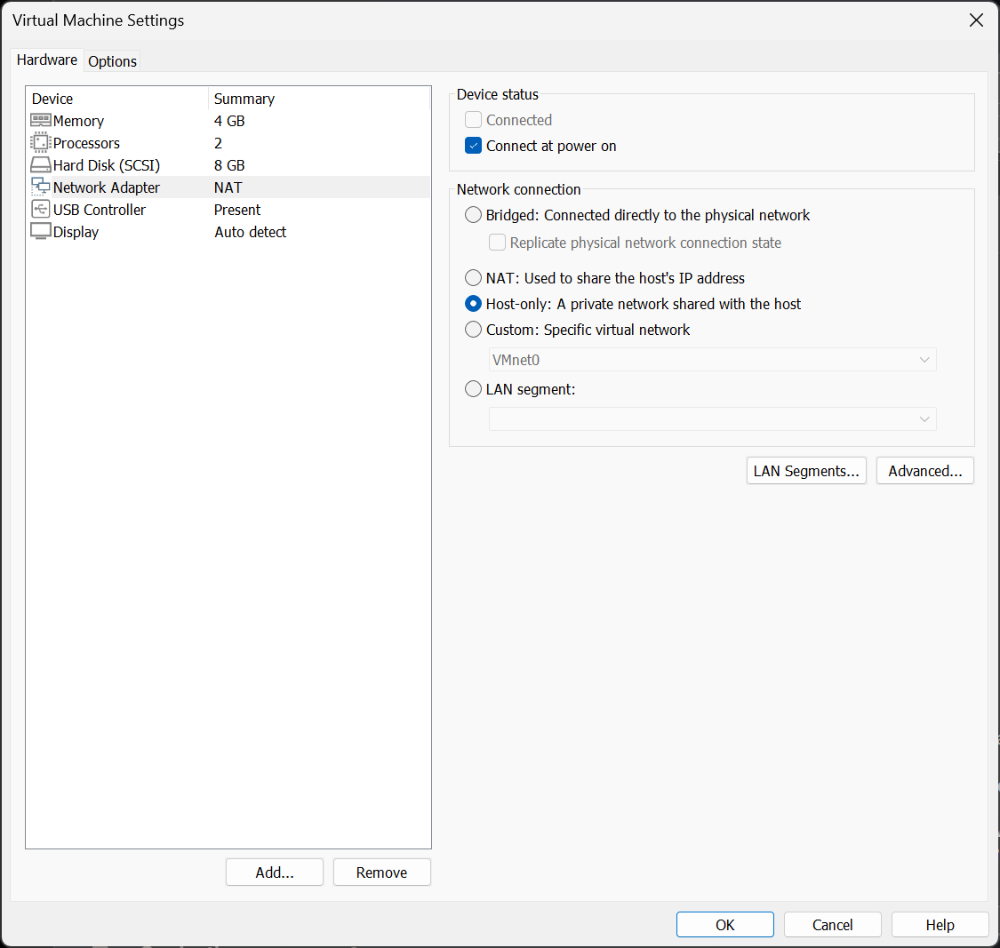
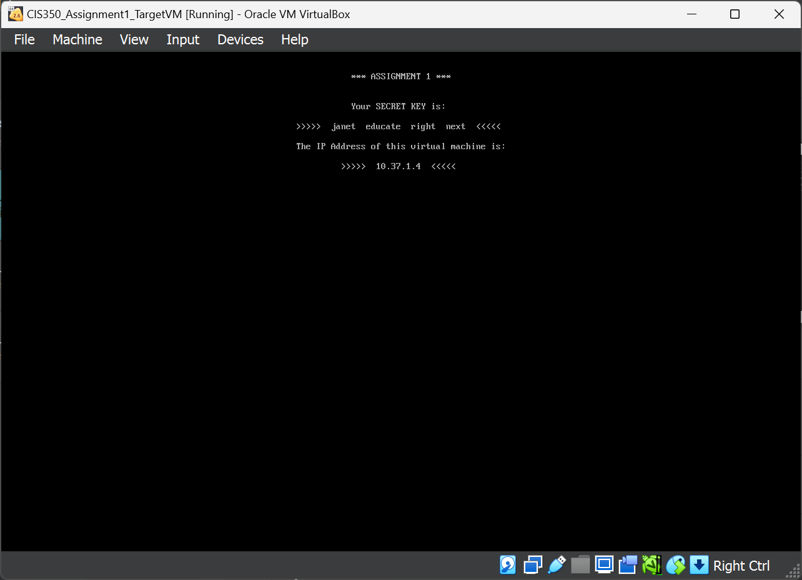
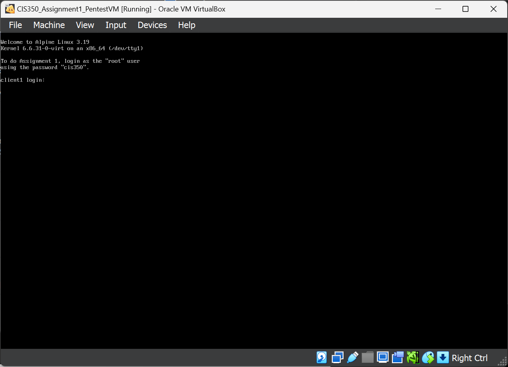
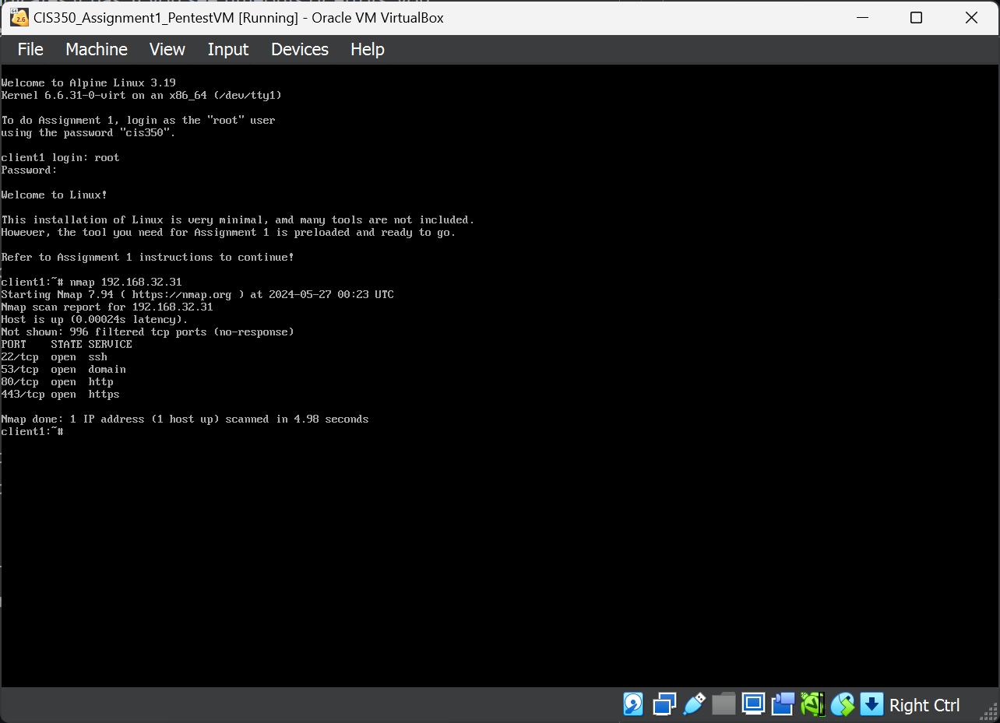

# Group Assignment 1

This assignment will give you some practice with executing a **port scan**, a simple type of reconaissance. Port scans allow you to probe a computer system to determine which of its IP ports are *listening* for incoming connections. While it is a relatively simple form of reconnaissance, many attackers use port scans across larger networks to test which systems might be running services of interest.

> **WARNING**
>
> Even something as simple as a port scan can be considered unauthorized access to a computer system, and if the owner of the system you scan detects the scan, you could face many consequences, including legal liability.
>
> In this exercise you will be scanning a virtual machine image that I provide to you. As part of this assignment, you have permission to scan this image. You can also, of course, scan any equipment owned by you. However, **you MUST NOT run port scans on ANY computer system that you do not own or for which you have not received explicit permission!** The consequences depend on the target, but could result in sanctions including being denied access to computing resources up through legal prosecution. **It's not worth it - DO NOT port scan anything you don't own or have permission to scan!**
>
> You are completely 100% responsible for your behavior when you practice cybersecurity skills. "I was learning how to port scan" is **absolutely not** a valid excuse or reason for port scanning, attacking, attempting to gain access to, or otherwise disrupting or probing a computer system you do not own or have permission to attack.
>
> If you are found to be executing port scans against systems you do not have permission to scan, you will immediately receive a grade of F for this course, as well as facing any consequences that result from such behavior.
>
> **Don't risk it!!**

For this exercise, you need to download two virtual machine images. The images can be downloaded from D2L in the Content section under "Assignment VM Images/Assignment 1".

There are two sets of images - one for VirtualBox users who are using Windows or Intel Macs, and one for UTM users on Apple Silicon Macs.

## Setup Steps

1. Download the two virtual machine images from D2L for your particular virtualization system.

1. Start by adding the "Target" virtual machine to your VM environment. See the [Importing VMs for Windows](VM_IMPORT.md#windows) or the [Importing VMs for Mac](VM_IMPORT.md#mac) documents for details on exactly how to add the VM to your environment.

1. Also add the "PenTest" VM to your environment.

1. **VERY IMPORTANT**: You MUST connect your virtual machines to a **Host-Only** network. (Failing to do this will result in significant point loss!)

   On Windows, go into the VM settings and ensure the network adapter is set to Host-Only.

   

   On Mac, go into the VM settings and set the network to "Private to my Mac."

1. Start up the Target VM.

    If the VM starts successfully, you should see a screen similar to this:

    

    **Take a screenshot of this screen**. The four code words on screen are required as part of your submission - not including these code words will result in significant loss of points.

1. Now, start up the PenTest VM.

    The VM should prompt you to login as `root` with a specific password. Log in by typing the username, pressing Enter, then typing the password given and pressing Enter.

    If you are successful, you should now see a screen similar to this:

    

    You are now ready to perform your port scan.

    (You do not need to screenshot the PenTest boot screen.)

1. On the PenTest VM, verify your IP address by typing the command:

        ip addr show dev eth0

    The `ip` command is a Linux command that lets you view and manipulate settings and information for network interfaces. This command is pretty straightforward: it asks to `show` the `addr`ess of `dev eth0`. Linux network devices have interface names and there are a few different schemes for assigning those addresses; a typical straightforward method is to simply name Ethernet interfaces `eth` followed by a number, in this case `0` for the first interface.

    Compare the IP address you see against the one displayed on the screen of the target VM. **Make sure the two IP addresses are on the same `/24` subnet**. In other words, make sure that the first three numbers of the IP address are the same.

1. Try to **ping** the target VM:

        ping <IP_of_target>

    If the ping works, you should see replies coming from the target VM at the IP address it indicates it has. If you see timeouts or errors, you need to check the configuration of both of your VMs to ensure they are both on the same Host-Only network.

    Press Ctrl+C to stop the ping command from running.

    **You do NOT need to include screenshots or proof of the ping command in your submission.**

1. Now it's time to actually execute the portscan.

## Portscan Steps

**Repeat these steps as many times as you have members of your group - it would be a good idea for each group member to perform the steps at least once.**

> If you have group members who are unable to run the virtual machines locally, you can use screen sharing to one group member to control another member's machine to perform the steps.

1. Power on the **target** VM if it is not already running.

1. Run the `namp` command as follows:

        nmap <IP_of_target>

    > **IMPORTANT:** **Replace** the string `<IP_of_target>` with the IP address displayed on the target VM's display. Running the command above *literally* as typed will fail - you *need* to change the placeholder!

    The `nmap` command will default to performing a simple port scan of 1,000 common service ports. All of the ports that the target VM might open are within these 1,000 ports.

    If you are successful, you should see a list of open ports, similar to this: *(note: your IP address and open ports* ***will differ*** - *so do not expect your results to match the ones pictured here)*

    

    Either **take a screenshot** or **make a note in your submission document**, showing the list of open ports. The port numbers are listed at the very left of the screen.

    In the **example** screenshot above, ports 22, 53, 80, and 443 are open on this machine.

    > A port scan is used only to discover which ports are available and soliciting connections on a server. Nmap can do advanced scanning to determine other characteristics of these ports, which we will discuss later.
    >
    > In an attack scenario, an attacker might use `nmap` to run port scans on a *range* of IP addresses. For example, `nmap 192.168.1.0/24` would scan all IP addresses which fit within that given subnet. Large port scans can take a long time, but are useful to an attacker since it can help them *map the network* (hence the original meaning of the `nmap` command) and potentially identify specific machines or targets of interest. As an example, many routers or networking gear will expose certain ports that are specifically used for maintenance of networks; finding these ports open indicates that it is possible that an attacker could gain control of the networking device and use it as a "springboard" to penetrate further into the network.

2. Power off the target VM by choosing "Power Off" in the menus. (Do not "save state" or "send shutdown signal" as neither of these will actually effect a full shutdown.)

3. **Repeat the port scan steps once for each of your group members**. (Power on the Target VM and wait for it to display its code words and IP address, then run `nmap` again to do another scan. Once again, screenshot or note both the code words and the list of open ports.) Power off the target VM each time and then turn it back on.

4. Once you're done, you can power off the target VM again, and finally you can type

        poweroff

    at the command prompt of the PenTest VM to power it off.

> **Important:** Each time you boot or reboot the Target VM, **it will select a new random code phrase** and thus, a new random set of open ports. Therefore, **please be careful to keep track of your various port scan runs.** If you are unsure, it is better to simply start the target VM again and run a new scan, making sure you note the code words *and* the open ports at the same time.

Grading works by comparing the code words against the open ports, using an algorithm which selects a set of ports based on the code words; thus, the importance of correctly noting both your code words and your open ports discovered via port scans.

## Deliverable

Your deliverable consists of *four* port scan trials. Each trial must include the four-word code phrase as well as the list of ports that were found to be open on the target VM with that code phrase.

You may submit screenshots or a simple document listing the code words and associated open ports. Either is acceptable, however you must include *both* pieces of information for *each* port scan trial you perform.

**This is a group project - only ONE submission per group is required!** If more than submission is made to D2L, I will grade the **most recent** submission that was submitted prior to the due date/time.

## Scoring Rubric

This group project is worth 100 points:

| Item | Points | Penalties |
|-|-|-|
| Successfully executed four port-scans of the target VM with different code words per scan | 80 | 20 points lost for any scan without code words. 20 points lost for scan with incorrect open ports. |
| Proper procedures and practices followed | 20 | Point loss depends on specific infraction and severity. |

All group members will receive the same score.

## Why?

Port scans are one of the simplest forms of **reconnaissance** - the act of discovering information about a target. Since many services run on standardized ports - such as Port 80 or 443 for web servers - scanning a given host to discover which services it is exposing can be a very useful *starting point* for a deeper exploration and, possibly, an attack on the system in question.

While port scans *on their own* typically will do no damage - a system that can be disrupted by *only* a port scan is a very weak system indeed - the traffic patterns of port scans are easily detectable - a port scan involves sending a very large number of connection requests to a host, all with differing port numbers and all within a short time span. Since there are very few legitimate uses for this type of traffic - especially at the scale of a port scan - many firewalls and security appliances will detect port scans heuristically and can apply any number of actions when they are detected, from blocking incoming traffic to logging and reporting the activity to administrator and/or authorities. While a port scan *alone* is rarely enough to get you in significant trouble, they still constitute a type of (mild) cybersecurity attack; thus, **remember to never port scan a system you do not have control over**.

Alongside port scans, a common technique is to actively engage with any open port discovered to try to ascertain more information about exactly what service - and more importantly, what *version* - is running there. This can be very useful - for example, if a given version of a server is discovered to have an easily-exploitable vulnerability, a scan for systems running that specific version of the server are now ripe targets for abuse.

### How do sites like Shodan "get away" with port scans?

Shodan is a recognized service within the cybersecurity community, and it has significant value for ethical and "white-hat" hackers. Since the site can be used to discover vulnerable systems based on current knowledge of vulnerabilities, many IT professionals use it as a "spot-check" on their own systems - if Shodan can find a vulnerable service, so can any malicious hacker. Thus, Shodan (and some similar services like it) have become recognized across the industry as a net good for cybersecurity, and thus are not targeted by cybersecurity enforcement efforts. Shodan also scans from known IP addresses, and thus if a network truly wishes to block their scans, it is easy to do so; it's also easy to differentiate Shodan scans from random scans on the Internet.

A scan coming from *your* computer means nothing - you could be a student in CIS 350, or you could be a malicious hacker planning an attack. There's no way to know. If you happened to scan the wrong server, you could find yourself under some pretty intense scrutiny. (Imagine if you accidentally scanned a server belonging to the CIA or the NSA...)

## Additional Resources

* [Shodan](https://www.shodan.io/) is a website that runs port scans across large portions of the Internet along with analyzing the services those open ports are exposing and collects the results into a database. It is commonly used both by cybersecurity professionals and hackers to search for and discover potentially vulnerable systems.

    > Note that Shodan is a legitimate organization that has become recognized in the cybersecurity community as a reliable source of information about public vulnerabilities and networks. Its existance still does not mean you should be performing port scans of your own. The IP addresses Shodan scans from are well known and many organizations explicitly allow them to scan from those addresses because of the net benefit to the cybersecurity community. **Again, do NOT port scan computers you don't have the right to scan for any reason!**

* Palo Alto Networks has [a page](https://www.paloaltonetworks.com/cyberpedia/what-is-a-port-scan) that discusses some of the technical details of how a port scan actually works. It explores concepts such as SYN/ACK packets and the different states a port may be in when scanned.

* This [YouTube video](https://www.youtube.com/watch?v=BHESuhyrGg4) by NetworkVerge will go into more depth on how port scans work with Nmap.

* GRC.com's [ShieldsUp!](https://www.grc.com/x/ne.dll?bh0bkyd2) service allows you to port scan *your own* computer. The website will initiate a port scan of *your* computer or Internet router to tell you which ports, if any, are open. **On most home Internet connections, you want all of your ports to be "filtered" unless you are running a public server for a specific reason**. This is a worthwhile test to make sure you are secure!
