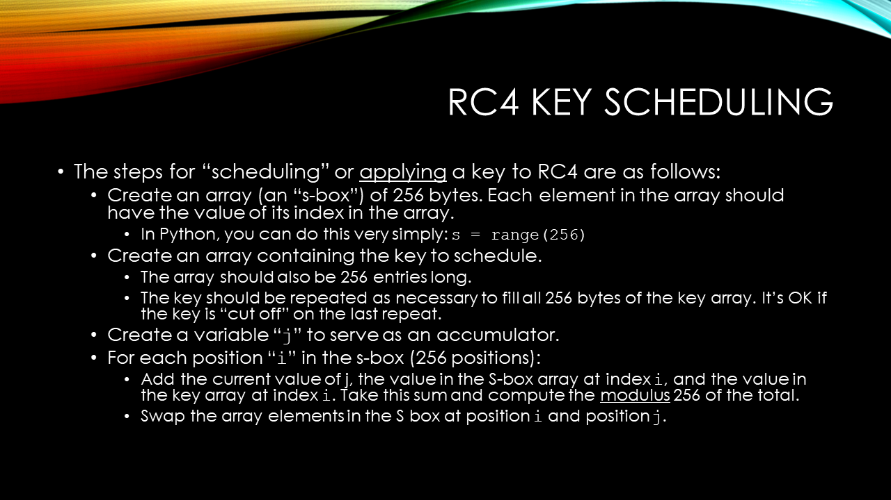
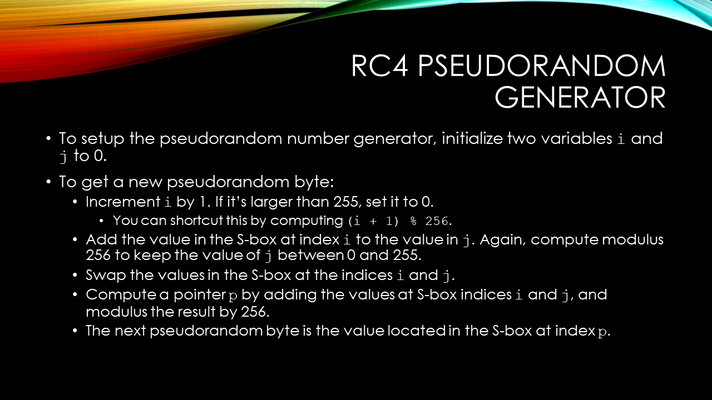

# Group Assignment 2

In this assignment you will **implement the RC4 algorithm** in a programming language of your choice.

You may select any modern programming language, including but not limited to:

* Python
* C# / .NET
* JavaScript (NodeJS, web page, etc.)
* Java
* Rust
* C++
* ...

Your program should do the following:

1. Create the S-box and **schedule a key** using the methods described in the slides (reproduced below). **You MAY use a hardcoded key, but you MUST set the key to a variable in your code.** Your code must actually run through the S-box scheduling algorithm.
1. Your code MUST, after scheduling the key, generate and *discard* 256 bytes of data from the pseudorandaom stream.
1. Take a given string, convert it to bytes (hint: Python has `.encode('utf-8')` to get an array of bytes from a normal string), and **encrypt it** by using the XOR operation on each byte of your message with bytes from your RC4 pseudorandom stream. **You MAY provide a static string as a hardcoded value, similar to the key, but you MUST store this initial string in its own variable.**
1. The program should output, either in hexadecimal or in integers, *all three* of the following:
    * the initial string, as hex or integers representing the bytes of that strong
    * RC4 pseudorandom bytes as generated by the stream cipher
    * the encrypted bytes, as a result of XORing bytes from the plaintext with bytes from the RC4 cipher stream

> **Extra Credit Opportunity**: 
>
> If you design your program in such a way that it can **accept both the key and the string to encrypt** as **command line arguments**, you will receive a 10% point bonus - even beyond 100%!
>
> For example, if you use Python, if I can run your program like this:
>
>     python rc4.py KEY.txt MESSAGE.txt
>
> and receive the printed bytes as output, that will qualify you for this extra credit.

> **IMPORTANT NOTE**: 
>
> You **MAY NOT** use any built-in functions or libraries to implement the RC4 cipher. You **MUST** implement the actual cipher yourself by implementing the steps to schedule a key and also generate random bytes, as well as XORing plaintext bytes.

> **Useful Hint**: 
>
> Use a **class** to implement your RC4 cipher! This will afford you the ability to use **class variables** for storing the state variables and the S-box.

## Slides

  The steps for “scheduling” or applying a key to RC4 are as follows:

  Create an array (an “s-box”) of 256 bytes. Each element in the array should have the value of its index in the array.

  In Python, you can do this very simply: `s = range(256)`

  Create an array containing the key to schedule. The array should also be 256 entries long. The key should be repeated as necessary to fill all 256 bytes of the key array. It’s OK if the key is “cut off” on the last repeat.
  
  Create a variable “j” to serve as an accumulator.

  For each position “i” in the s-box (256 positions):

  * Add the current value of j, the value in the S-box array at index i, and the value in the key array at index i. Take this sum and compute the modulus 256 of the total.
  * Swap the array elements in the S box at position i and position j.

To setup the pseudorandom number generator, initialize two variables i and j to 0.

To get a new pseudorandom byte:

1. Increment i by 1. If it’s larger than 255, set it to 0.
1. You can shortcut this by computing `(i + 1) % 256`.
1. Add the value in the S-box at index `i` to the value in `j`. Again, compute modulus 256 to keep the value of `j` between 0 and 255.
1. Swap the values in the S-box at the indices `i` and `j`.
1. Compute a pointer `p` by adding the values at S-box indices `i` and `j`, and modulus the result by 256.
1. The next pseudorandom byte is the value located in the S-box at index `p`.

## Verification

The following are examples that you can use to **verify that your code is working properly.**

1.
   * Key: `SuperSecret!`
   * Message: `hello world`
   * Resulting bytes as hex: `35 ae 1f e5 45 6f 39 7d 8f c4 8e`
   * Resulting bytes as integers: `53 174 31 229 69 111 57 125 143 196 142`
2.
    * Key: `cis350`
    * Message: `Assignment 2`
    * Resulting bytes as hex: `d1 ea 95 28 89 9a 76 bb 26 17 a6 bd`
    * Resulting bytes as integers: `209 234 149 40 137 154 118 187 38 23 166 189`

## Tips

* Don't print the *character* represented by the encrypted byte(s), instead print the hexadecimal and/or integer representation of the byte's value. While many characters will print fine, many values will produce unprintable characters or even encoding errors.
* Remember to **repeat the key bytes** as many times as necessary to fully fill up the key array. Truncate the last repetition if the array ends up being more than 256 bytes, but do include the portion of the key that fits.
* Every programming language should have a method for performing an XOR operation on two integers. For example, given two integers `i` and `j` in Python, you can compute the XOR by using the `^` operator: `i ^ j`. Remember XOR is *symmetric*, so it doesn't matter which value is on either side of the XOR operation.

## Deliverable

The deliverable consists of working source code in your group's preferred programming language. You may submit your code in a few ways:

* As a `.zip` file on D2L.
* As a link to a `.zip` file in shared storage that you have given me access to
* As a link to a GitHub or other publicly accessible code repository

This group project is due on **Sunday, June 8th, 2025**. Only **ONE** submission per group is required.

## Scoring Rubric

This group project is worth 200 points:

| Item | Points | Penalties |
|-|-|-|
| Successfully wrote functional code that implements the RC4 algorithm | 160 | 40 points lost for any of the following missing or incorrect: key scheduling algorithm, discard first 256 bytes, encrypt a string. 80 points lost if any part of the code uses a prebuilt or system library to perform any part of the *encryption* functionality. |
| Proper procedures and practices followed | 40 | Point loss depends on specific infraction and severity. |

All group members will receive the same score. *If you have concerns about a group member (for example, a member not contributing fairly to the project), you may contact me* ***privately*** *by E-mail to discuss the matter.*

## Additional Resources

* The [Wikipedia page](https://en.wikipedia.org/wiki/RC4) on RC4.
* Some [technical detail](https://googleprojectzero.blogspot.com/2022/10/rc4-is-still-considered-harmful.html) on RC4's weaknesses and impacts
