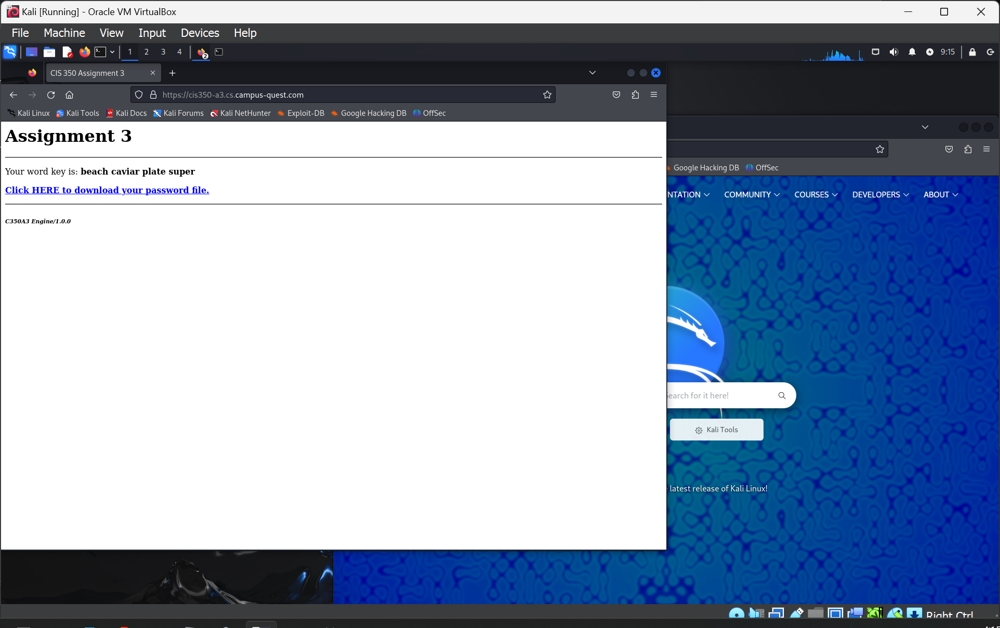
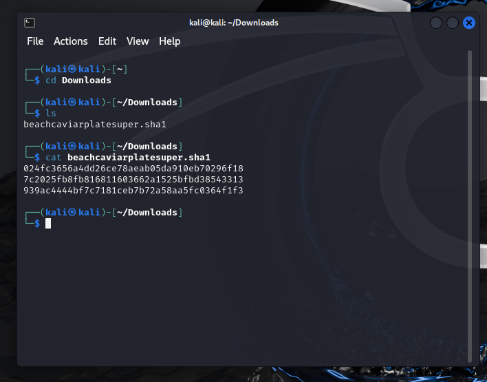
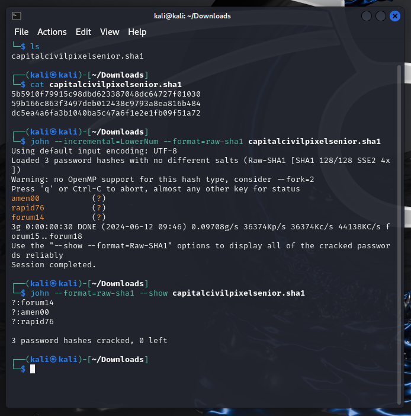

# Group Assignment 3

In this exercise, you will learn about password hash cracking and how hackers might be able to use stolen password databases to determine users' passwords, even if the passwords are stored in a hashed form.

> **WARNING**
>
> Even something as simple as a port scan can be considered unauthorized access to a computer system, and if the owner of the system you scan detects the scan, you could face many consequences, including legal liability. 
>
> You will be using tools in this exercise that can potentially determine a user's password given a hash. While most modern credential storage systems are far less susceptible to such an attack, users may still choose to use "easy" passwords that can be easily reverse engineered. Regardless, it is still illegal to access any system as a user other than yourself unless you have explicit permission to do so - "but they chose a weak password!" is not a valid excuse.
> 
> You are completely 100% responsible for your behavior when you practice cybersecurity skills. "I just wanted to see if my friend used a secure password" is **absolutely not** a valid excuse or reason for attacking, attempting to gain access to, or otherwise disrupting a computer system you do not own or have permission to attack. 

For this machine. **you MAY connect your Kali Linux VM to the Internet**. You need to do this so that you can access the web site that will generate your password file for you. **Remember that while you are connected to the Internet with a penetration testing system, you MUST NOT run any tools that will execute live attacks against any system you do not have permission to attack.**

## Steps

1. Connect your Kali Linux VM to the Internet.

1. Inside the Kali Linux VM, start the Firefox web browser.
    
    
    
1. In the browser, visit the website: <https://cis350-a3.cs.campus-quest.com/>

    

1. The website should give you four code words and a *link to download a password file*. Click the link to download the file of hashes.

    The file will be named as the four code words with no spaces, followed by `.sha1`. For example: `thesearecodewords.sha1`. 

    As usual, the code words will be random and will be re-selected each time you load the website.

1. Open a Terminal in Kali.

1. Use the `cd` command to switch into the `Downloads` directory:

        cd Downloads

1. (Optional, not required for submission) Use the `ls` command to view the list of files. You should see the file you just downloaded from the website. Use the `cat` command to print out the actual cryptographic hashes.

    > **Hint**: Linux command line interfaces support a feature known as *tab completion*, where you can type "enough" of a file or directory name and then press the Tab key to complete the rest of it. For example, if your password file was called `thesearecodewords.sha1`, you would be able to simply type the letter `t` followed by the Tab key, and the rest of the filename will be filled in for you.
    >
    > In this case, you can type `cat`, followed by a space, then the first letter of your password file, then the Tab key.

    The screenshot below shows the past few steps:

    

1. Now it's time to crack the passwords!

    We will use a tool known as [John the Ripper](https://www.openwall.com/john/), which is a brute-force password guessing tool. While it does use brute force, it does have some "intelligence" in that it will first try the "easy way", by iterating over an internal dictionary of common words used in passwords, along with numbers, symbols or other similar common additions. Failing that, it will fall into brute-force mode, where it will begin to crank away at guessing every possible password.

    To run John the Ripper on your password file:

        john --format=raw-sha1 <your_password_filename>

    *As always, replace `<your_password_filename>` with the actual file name you downloaded from the server!* Also, remember that you can use Tab Completion to more quickly type in the filename.

    > **Tips:** A John the Ripper run will use a lot of computing power. Depending on your laptop, it may take several minutes to crack the passwords. Importantly, this *will* stress your computer's CPU. Here are a few tips:
    >
    > * Even on a decently fast computer, the cracking process may take *several minutes* or even over *one hour*. This may be a task you want to start before going to bed or doing something else for a while!
    > * If you are using your laptop on a soft surface, such as a couch or bed, it is advisable to move your laptop to a solid surface such as a table to reduce the chance of overheating.
    > * If you are running your laptop on batteries, expect this process to significantly drain your battery while it runs. I *strongly* recommend you plug in your laptop first!
    > * If your laptop has multiple cores, you can reconfigure your Kali Linux VM to utilize more cores, and then you can add the `--fork` switch to John to use more cores, like this:
    >
    >     `john --format=raw-sha1 --fork=4 <your_password_file>`
    >
    >     Replace `4` with the number of cores you allocate to the Kali Linux VM. More cores will make the hash cracking process go faster.

1. Once John the Ripper finishes determining the passwords, you can then print out the results in a cleaner format by running:

        john --format=raw-sha1 --show <your_password_file>

    > **Hint:** If you have waited a *very long* time - over an hour - and still don't have all of the passwords, let's try a trick to speed things up.
    >
    > Let's assume we know that these passwords are relatively simple - that they consist only of lowercase alphanumeric characters and numbers. That being said, we can instruct John to optimize its search by only checking values within that "alphabet" by adding the option `--incremental=LowerNum` to the command line, like this:
    >
    > `john --incremental=LowerNum --format=raw-sha1 <your_password_file>
    >
    > You can press Q to stop John from running, then issue this command.

1. Make a note of the passwords that John found along with the code words that the web site displayed to you.

    You may do this by taking a screenshot or typing the values into a Word document.

    The following screenshot shows a successful `john` run:

    

1. You can remove the password file from the Downloads directory by using the `rm` command, followed by a space, and the filename. For example:

        rm thesearecodewords.sha1

    (remember to use *your* filename!)

1. Repeat steps 3-11 **three** more times, for a total of **four** (4) runs of downloading and cracking the password hashes. Alternatively, your group members can all run this task at the same time to save you time!

## What We Learned

The passwords generated by the website and hashed into the password file are simple passwords consisting of a single, short word along with two digits. These passwords are very simple and can be relatively quickly cracked using tools like John the Ripper. For reference, a 5-character lowercase word followed by a 2-digit number yields 1,188,137,600 possible passwords. As we discussed, this number may seem big, but it's quite small and even your own computer is able to crack it relatively quickly. 

Our configuration doesn't allow for some of the advanced methods of running a tool like `john`, such as utilizing GPU power or (unless you reconfigured Kali to do so) using multiple CPU cores. But even so, we're able to crack these passwords in relative short order. If we did have use of these other facilities, we could likely crack these passwords in mere seconds.

If it isn't obvious already, this is exactly why we should use long, complex passwords. Short passwords just don't leave enough possible values, and since we as humans strongly lean towards using memorable, easy to understand passwords, the potential search space is that much smaller. 

Another thing to note is that this exercise uses the SHA-1 hash, which is not only considered to be outdated, but is also faster to perform - even a modest computer can perform millions of these SHA-1 hashes per second on each CPU core. 

The way that we protect ourselves against this type of attack today is through many steps:

* We do not use SHA-1 for password hashing. Instead, we will typically use a hash algorithm that is **deliberately slow** (memory-hard). 

    A powerful modern desktop PC might be able to check 50 million SHA-1 hashes per second per CPU core. Advanced Bitcoin-mining hardware might be able to process *trillions* of SHA hashes per second. However, there is no need for typical password *verification* to be that fast. Algorithms such as **bcrypt** and **argon2** allow you to specify extra "rounds" so that the process of hashing takes longer; hashes like **argon2** also are known as "memory-hard", which means they require a significantly larger amount of memory than the simple SHA-1 hash.

    If we use a hash that takes, say, one second to hash, that time period is almost imperceptible when it comes to logging into a system and having that system check your password. However, it also means that a program such as `john` can now only check a measly **60** possible passwords per *minute*, as compared to tens of millions of them! 

* We use a technique known as *salting* the password, which means that a company will append a known long string to every password prior to hashing it. This means that the hashes actually represent much, *much* longer passwords - even if you give a password as simple as "hello123", the hash algorithm will actually hash a very long password, meaning tools like John cannot simply guess all the passwords to figure yours out.

    > If a person is able to learn the value of the salt for a given system, they could potentially use John against that system's hashes. However, generic hash cracks will no longer work.

* We encourage people to use long, complex passwords that are difficult or impossible to guess.

With this exercise, you have hopefully learned *why* everyone demands you use complex passwords - and what might happen if you don't!

## Submission

Your submission must include the following components:

* ***Four*** sets of code words along with the three passwords they represent.

This assignment will be due **Sunday, November 10th** at **11:59 PM**.

## Scoring Rubric

This group project is worth 100 points:

| Item | Points | Penalties |
|-|-|-| 
| Included three sets of code words along with cracked passwords. | 90 | Partial point loss if the screenshot does not show the correct data. Full point loss up to 30 points per set if missing. |
| Proper procedures and practices followed | 10 | Point loss depends on specific infraction and severity. |

All group members will receive the same score, **unless one or more group members are found to not be contributing fairly.** If you have group members that are not responsive or not participating. **PLEASE LET ME KNOW.** Failure to report poor group member performance may have an impact on *your* grade!
