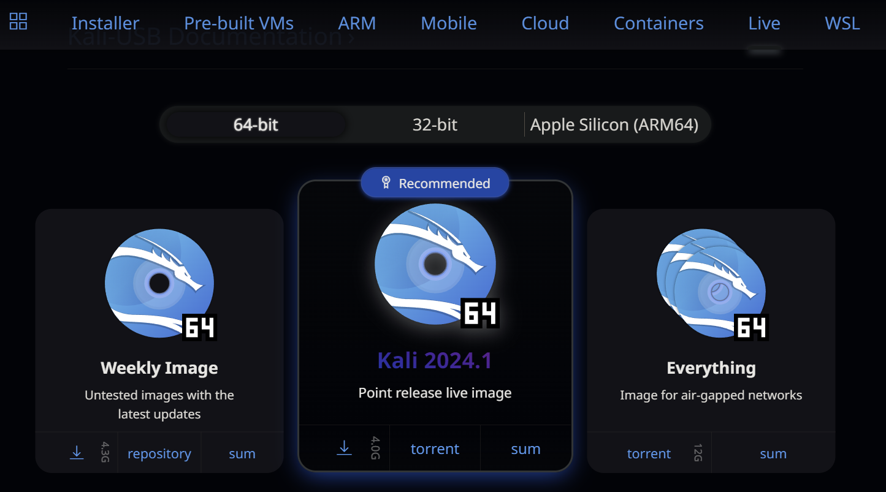
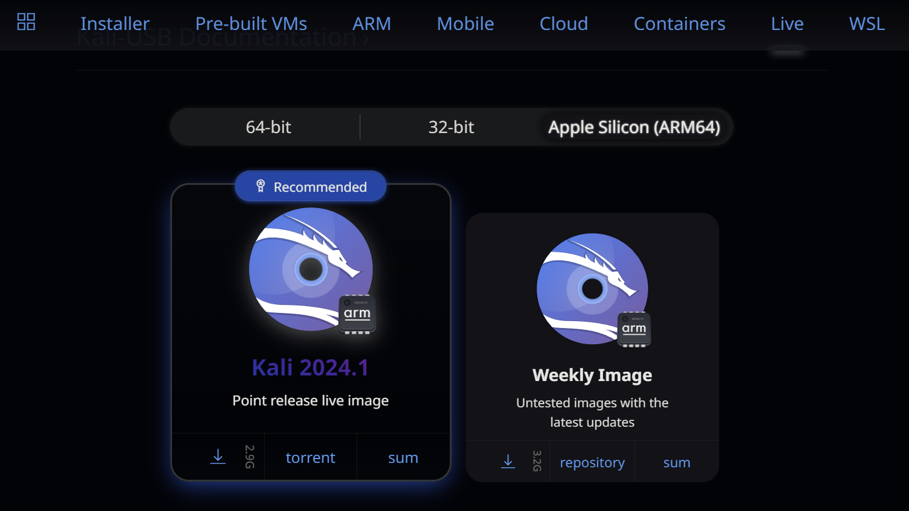
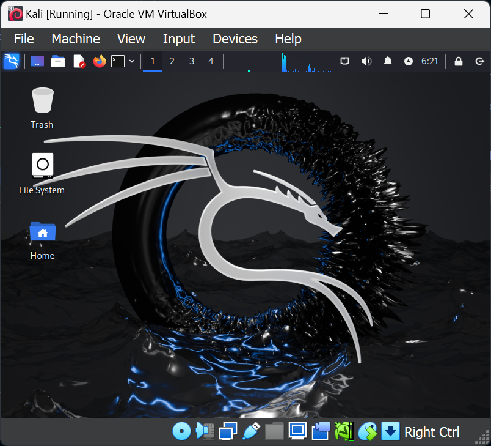

# Kali Linux

[Kali Linux](https://www.kali.org/) is a Linux version that is designed for cybersecurity professionals. It includes a wide range of tools used for penetration testing, security analysis, forensices and research. It is free and open source.

> NOTE: The default username for Kali Linux is `kali`, and the password is also `kali`. If you are ever prompted for a username and password when running Kali Linux, use this username and password.

## Get Kali

For CIS 350, you will not need to actually install Kali directly. Instead, you will use Kali in its "live" mode, in which you run it directly from the DVD ISO image. This is very much like what we did for the initial Ubuntu test. 

To download Kali, visit [the Kali Linux Download page](https://www.kali.org/get-kali/#kali-live). On this page, you'll see the option to get the current version (2024.1 as of this writing). 

* If you are on a Windows PC, you should download the "64-bit" version:

    

* If you are on an Apple Silicon Mac (M1, M2, M3, etc. processor - basically anything after 2020), you should first choose the Apple Silicon option.

    

Once you are on the correct page, just click the Download  icon to get your copy of Kali Linux.

> The image is rather large - around 4GB - so depending on your Internet connection, the download may take some time.

## Boot Kali

For projects in this course, you will use Kali as your "pentest" VM. (In assignment 1 you used a custom provided pentest VM - now you will use Kali as your pentest VM. You will still be provided with target VMs and instructions.)

Create a new virtual machine in your VM environment and configure it as a Linux virtual machine, specifying the ISO image you downloaded as the "install disc". 

> **Tip:** On VMware, it is possible to skip creating a hard drive completely, since you will not be storing any data on the Kali Linux VM. 

If you are successful, you should see the Kali desktop screen in your VM:

**At this point, your Kali VM is probably connected to the Internet.** This is fine for now, since we aren't actually executing any attacks. However, for one of the two assignments, you will need to change Kali's network interface to the Local Only interface. 

### What's Next

You'll use Kali Linux in two of the group assignments for the course. However, take some time to "poke around" and look at the wealth of tools and software available to you in Kali. The tools cover a wide variety of security testing, analysis and design scenarios, from reconnaissance (such as nmap) to packet sniffing (with Wireshark) to exploit testing (with Metasploit) and more. 

> Final reminder:
>
> Kali Linux is full of powerful tools that can get you in trouble if misused. Before you run any Kali tool against any computing system, make sure that you:
>
> * know what the tool does and what using it could do to the target
> * have permission to, or own, the computer(s)/network(s) you are targeting
> * practice ethical hacking standards and procedures

