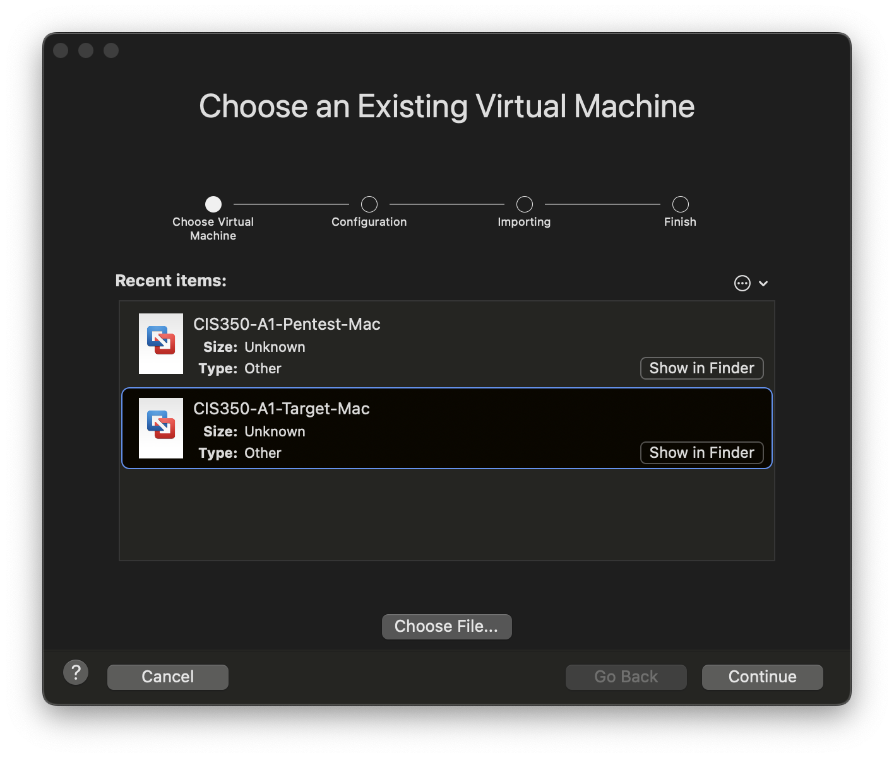
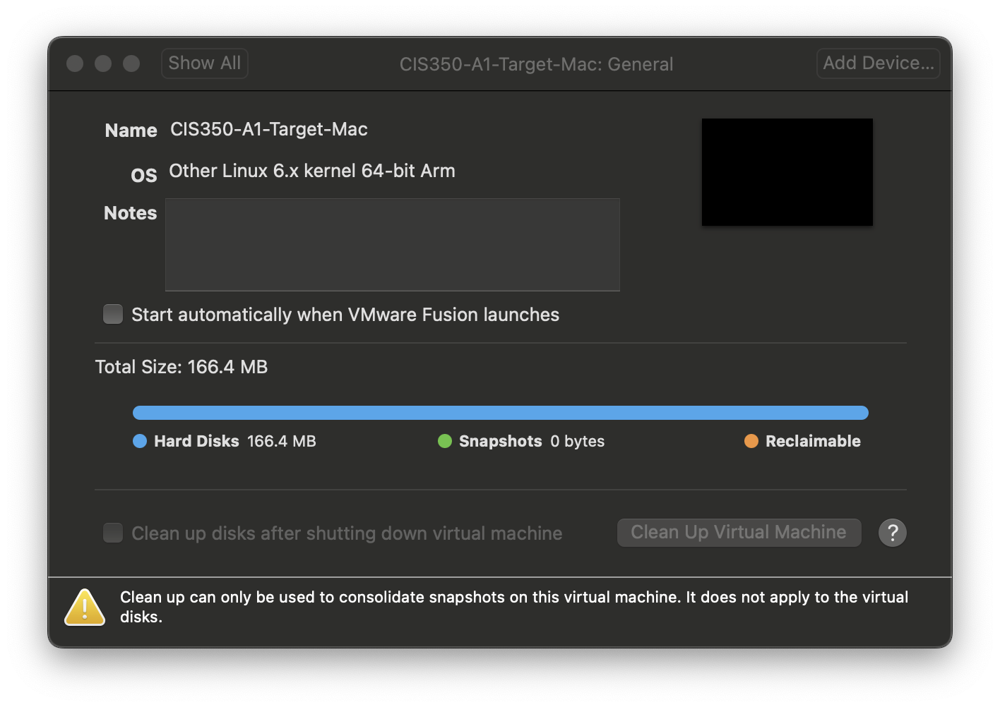

# Importing .OVA Virtual Machine Images

This documentation explains how to import a packaged virtual machine into your VMware environment.

## Windows

On Windows, simply open the `.ova` file in Windows Explorer.

VMware Workstation will prompt you for a name for the new VM. Give the VM a name that is *easily recognizable* - for example, just use the existing filename. Of specific importance is to keep the Target and PenTest VMs separate.

You should not need to make any other changes - finish running through the wizard to import the VM.

## Mac

> NOTE: If you are on an older **Intel-based Mac**, you can use the Windows `.ova` files and import them into VMware Fusion. You do NOT need to take the extra steps listed below to set the OS setting.

Importing a VM on a Mac is very similar, but involves one extra step.

Open the `.ova` file in the Finder. VMware will prompt you to import the VM:

Select the VM you're importing in the list and finish running through the wizard. You should not need to make any other changes.

Before you can start the VM, you will need to *modify a setting in the VM's configuration*. Open the Settings window for the VM and open the General section.

Change the "OS" to read "Other Linux 6.x kernel 64-bit Arm" as shown below:

Close the settings window and accept any prompt if given.

> If you forget this step, you will receive an error trying to start the VM indicating it requires an x86 processor. If you get this error, go into the VM's settings and adjust the OS setting as indicated here.
